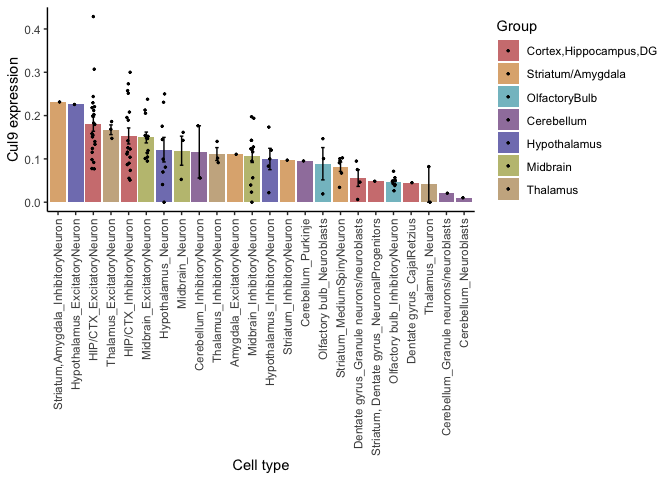
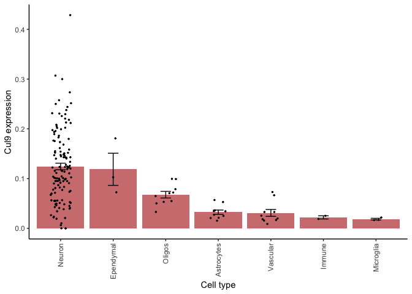
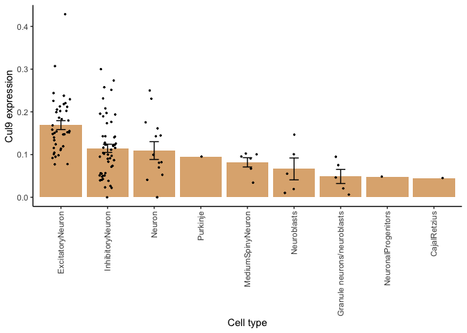

Holville\_Cul9
================
Jeremy M. Simon
2/08/22

## Holville et al. 2022 (in preparation)

This repository contains `R` code to generate some of the figures
presented in Holville *et al.* 2022 (*in preparation*).

We used publicly available scRNA-seq data in adolescent mice to
illustrate the cell types in which Cul9 is most highly expressed.

scRNA-seq data were obtained from [this
repository](http://mousebrain.org/adolescent/downloads.html),
corresponding to [Zeisel et
al 2018](https://www.cell.com/cell/fulltext/S0092-8674\(18\)30789-X).

Expression for Cul9 was averaged across all cells from a given cell
type.

Additionally, for plots containing brain region information, clusters
were grouped into principal cell types and brain regions as follows:

  - Any cell type containing the string “GLU” were designated as
    “ExcitatoryNeuron”

  - Any cell type containing the string “INH”, or named “OBNBL4”,
    “OBNBL5”, “OBDOP”, or “TECHO” were designated as
    “InhibitoryNeuron”

  - Cell types named “CBNBL”, “OBNBL1”, “OBNBL2”, or “OBNBL3” were
    designated as “Neuroblasts”

  - Cell types named “DGNBL” or “GRC” were designated as “Granule
    neurons/neuroblasts”

  - “SZNBL” were renamed to “NeuronalProgenitors”

  - “MSN” were renamed to “MediumSpinyNeurons”

  - “MGL” were renamed to “Microglia”

  - “CR” were renamed to “CajalRetzius”

  - “CBPC” were renamed to “Purkinje”

  - Data from Cortex, Hippocampus, and Dentate Gyrus (DG) were grouped
    into “Cortex,Hippocampus,DG”

  - Data from Pons, or generically named “Brain” was renamed “Other”

  - Data from regions generically named “CNS” or “Telencephalon” were
    grouped into “NonNeurons”

Plots were generated in `R` version 4.0.2 and plotted with `ggplot2`.
Error bars represent the standard error.

## Load packages

    library(loomR)
    library(tidyverse)

## Read in adolescent expression data and metadata

``` r
lfile <- connect(filename = "~/Downloads/l5_all.agg.loom", mode = "r",skip.validate=T)
```

    ## Warning in .subset2(public_bind_env, "initialize")(...): Skipping validation step, some fields are not populated

``` r
lin=lfile[["matrix"]][,]
colnames(lin) = lfile[["row_attrs/Gene"]][]
rownames(lin) = lfile[["col_attrs/ClusterName"]][]
lin.t=t(lin)

cluster = lfile[["col_attrs/ClusterName"]][]
region = lfile[["col_attrs/Region"]][]
class = lfile[["col_attrs/Class"]][]
```

## Tidy and join expression and metadata

``` r
lin.tbl = rownames_to_column(as.data.frame(lin.t),var="Gene") %>% 
    as_tibble() %>%
    pivot_longer(cols=!Gene,names_to="Cluster",values_to="Expression")

annot = cbind(cluster,region,class)
colnames(annot) = c("Cluster","Region","Class")
annot.tbl = as.data.frame(annot) %>% as_tibble()

joined = left_join(lin.tbl,annot.tbl)
```

    ## Joining, by = "Cluster"

## Filter data for Cul9 only, then summarize data by principal cell type and brain region and plot

## Figure 1: Neurons only, by brain region and cell type

``` r
joined %>%
    filter(Gene=="Cul9") %>%
    filter(str_detect(Region, "Cortex") | Region=="Amygdala" | Region=="Telencephalon" | Region=="CNS" | Region=="Dentate gyrus" | str_detect(Region, "Hippocampus") | Region=="Olfactory bulb" | Region=="Brain" | str_detect(Region, "Cerebellum") | str_detect(Region, "Striatum") | str_detect(Region,"halamus") | str_detect(Region,"Midbrain")) %>%
    mutate(
        CellType = case_when(
            str_detect(Cluster, "GLU") ~ "ExcitatoryNeuron",
            str_detect(Cluster, "INH") | str_detect(Cluster, "OBNBL4") | str_detect(Cluster, "OBNBL5") | str_detect(Cluster, "OBDOP") | Cluster=="TECHO" ~ "InhibitoryNeuron",
            str_detect(Cluster, "SZNBL") ~ "NeuronalProgenitors",
            str_detect(Cluster, "CBNBL") | str_detect(Cluster, "OBNBL1") | str_detect(Cluster, "OBNBL2") | str_detect(Cluster, "OBNBL3") ~ "Neuroblasts",
            str_detect(Cluster, "MSN") ~ "MediumSpinyNeurons",
            str_detect(Cluster, "MGL") ~ "Microglia",
            Cluster=="CR" ~ "CajalRetzius",
            Cluster=="CBPC" ~ "Purkinje",
            str_detect(Cluster, "DGNBL") | str_detect(Cluster, "GRC") ~ "Granule neurons/neuroblasts",
            T ~ Class
        )
    ) %>%
    mutate(Region = str_replace_all(Region," dorsal","")) %>%
    mutate(Region = str_replace_all(Region," ventral","")) %>%
    mutate(Region = str_replace_all(Region,"Striatum, Striatum","Striatum")) %>%
    mutate(Region = str_replace_all(Region,"Striatum,Striatum","Striatum")) %>%
    mutate(Region = str_replace_all(Region,"Midbrain,Midbrain","Midbrain")) %>%
    mutate(Region = str_replace_all(Region,"Hippocampus,Cortex","HIP/CTX")) %>%
    mutate(Region = str_replace_all(Region,"Hippocampus","HIP/CTX")) %>%
    mutate(Region = str_replace_all(Region,"Cortex","HIP/CTX")) %>%
    mutate(
        Group = case_when(
            str_detect(CellType, "Astro") | str_detect(CellType, "Oligo") | str_detect(CellType, "Ependymal") | str_detect(CellType, "Vascular") ~ "NonNeurons",            
            str_detect(Region, "ippo") | str_detect(Region, "ortex") | str_detect(Region, "entate") | str_detect(Region, "HIP/CTX") ~ "Cortex,Hippocampus,DG",
            str_detect(Region, "Amygdala") ~ "Striatum/Amygdala",
            str_detect(Region, "Striatum") ~ "Striatum/Amygdala",
            str_detect(Region, "Olfactory") ~ "OlfactoryBulb",
            str_detect(Region, "Pons") ~ "Other",
            str_detect(Region, "Cerebellum") ~ "Cerebellum",
            str_detect(Region, "CNS") | str_detect(Region, "Telencephalon") ~ "NonNeurons",
            str_detect(Region, "Brain") ~ "Other",
            str_detect(Region,"Hypothalamus") ~ "Hypothalamus",
            str_detect(Region,"Thalamus") ~ "Thalamus",
            str_detect(Region,"Midbrain") ~ "Midbrain",
        )
    ) %>%
    filter(Group!="Other") %>%
    mutate(CellType = str_replace_all(CellType,"Neurons","Neuron")) %>%
    filter(str_detect(CellType,"euro|Purkinje|Cajal")) %>%
    unite("Cells",c(Region,CellType),sep="_",remove=FALSE) %>%
    mutate(Group = str_replace_all(Group,"HIP/CTX","Cortex,Hippocampus,DG")) %>%
    mutate(Group = fct_relevel(Group,c("Cortex,Hippocampus,DG","Striatum/Amygdala","OlfactoryBulb","Cerebellum","Hypothalamus","Midbrain","Thalamus"))) %>%
    ggplot(aes(x=reorder(Cells,-Expression),y=Expression,fill=Group)) +
    geom_bar(stat = "summary", fun = "mean") +
    stat_summary(geom = "errorbar", fun.data = mean_se, position = position_dodge(0.9), width=0.2) +
    geom_point(position=position_jitterdodge(jitter.width=0.95,dodge.width=0.9),pch=19,size=0.5) +
    theme_classic() + 
    theme(axis.text.x = element_text(angle = 90, hjust = 1, vjust = 0.5)) +
    scale_fill_manual(values = c("Cortex,Hippocampus,DG" = "#D08080", "Striatum/Amygdala" = "#DFB17F", "OlfactoryBulb" = "#84C0CA", "Cerebellum" = "#A081AB", "Hypothalamus" = "#8180BD", "Midbrain" = "#C0C080", "Thalamus" = "#CAB28F", "NonNeurons" = "#C0C0C0")) +
    scale_colour_manual(values = c("Cortex,Hippocampus,DG" = "#D08080", "Striatum/Amygdala" = "#DFB17F", "OlfactoryBulb" = "#84C0CA", "Cerebellum" = "#A081AB", "Hypothalamus" = "#8180BD", "Midbrain" = "#C0C080", "Thalamus" = "#CAB28F", "NonNeurons" = "#C0C0C0")) +
    xlab("Cell type") +
    ylab("Cul9 expression")
```

<!-- -->

## Figure 2: All neurons vs each non-neuron class separated

``` r
joined %>%
    filter(Gene=="Cul9") %>%
    filter(str_detect(Region, "Cortex") | Region=="Amygdala" | Region=="Telencephalon" | Region=="CNS" | Region=="Dentate gyrus" | str_detect(Region, "Hippocampus") | Region=="Olfactory bulb" | Region=="Brain" | str_detect(Region, "Cerebellum") | str_detect(Region, "Striatum") | str_detect(Region,"halamus") | str_detect(Region,"Midbrain")) %>%
    mutate(
        CellType = case_when(
            str_detect(Cluster, "GLU") ~ "Neuron",
            str_detect(Cluster, "INH") | str_detect(Cluster, "OBNBL4") | str_detect(Cluster, "OBNBL5") | str_detect(Cluster, "OBDOP") | Cluster=="TECHO" ~ "Neuron",
            str_detect(Cluster, "SZNBL") ~ "Neuron",
            str_detect(Cluster, "CBNBL") | str_detect(Cluster, "OBNBL1") | str_detect(Cluster, "OBNBL2") | str_detect(Cluster, "OBNBL3") ~ "Neuron",
            str_detect(Cluster, "MSN") ~ "Neuron",
            str_detect(Cluster, "MGL") ~ "Microglia",
            Cluster=="CR" ~ "Neuron",
            Cluster=="CBPC" ~ "Neuron",
            str_detect(Cluster, "DGNBL") | str_detect(Cluster, "GRC") ~ "Neuron",
            T ~ Class
        )
    ) %>%
    mutate(CellType = str_replace_all(CellType,"Neurons","Neuron")) %>%
    ggplot(aes(x=reorder(CellType,-Expression),y=Expression,fill=CellType)) +
    geom_bar(stat = "summary", fun = "mean") +
    stat_summary(geom = "errorbar", fun.data = mean_se, position = position_dodge(0.9), width=0.2) +
    geom_point(position=position_jitterdodge(),pch=19,size=0.5) +
    theme_classic() + 
    theme(legend.position = "none",axis.text.x = element_text(angle = 90, hjust = 1, vjust = 0.5)) +
    scale_fill_manual(values = c("Astrocytes" = "#D08080", "Ependymal" = "#D08080", "Immune" = "#D08080", "Microglia" = "#D08080", "Neuron" = "#D08080", "Oligos" = "#D08080", "Vascular" = "#D08080")) +
    scale_colour_manual(values = c("Astrocytes" = "#D08080", "Ependymal" = "#D08080", "Immune" = "#D08080", "Microglia" = "#D08080", "Neuron" = "#D08080", "Oligos" = "#D08080", "Vascular" = "#D08080")) +
    xlab("Cell type") +
    ylab("Cul9 expression")
```

<!-- -->

## Figure 3: Neurons only, by type

``` r
joined %>%
    filter(Gene=="Cul9") %>%
    filter(str_detect(Region, "Cortex") | Region=="Amygdala" | Region=="Telencephalon" | Region=="CNS" | Region=="Dentate gyrus" | str_detect(Region, "Hippocampus") | Region=="Olfactory bulb" | Region=="Brain" | str_detect(Region, "Cerebellum") | str_detect(Region, "Striatum") | str_detect(Region,"halamus") | str_detect(Region,"Midbrain")) %>%
    mutate(
        CellType = case_when(
            str_detect(Cluster, "GLU") ~ "ExcitatoryNeuron",
            str_detect(Cluster, "INH") | str_detect(Cluster, "OBNBL4") | str_detect(Cluster, "OBNBL5") | str_detect(Cluster, "OBDOP") | Cluster=="TECHO" ~ "InhibitoryNeuron",
            str_detect(Cluster, "SZNBL") ~ "NeuronalProgenitors",
            str_detect(Cluster, "CBNBL") | str_detect(Cluster, "OBNBL1") | str_detect(Cluster, "OBNBL2") | str_detect(Cluster, "OBNBL3") ~ "Neuroblasts",
            str_detect(Cluster, "MSN") ~ "MediumSpinyNeurons",
            str_detect(Cluster, "MGL") ~ "Microglia",
            Cluster=="CR" ~ "CajalRetzius",
            Cluster=="CBPC" ~ "Purkinje",
            str_detect(Cluster, "DGNBL") | str_detect(Cluster, "GRC") ~ "Granule neurons/neuroblasts",
            T ~ Class
        )
    ) %>%
    mutate(CellType = str_replace_all(CellType,"Neurons","Neuron")) %>%
    filter(str_detect(CellType,"euro|Purkinje|Cajal")) %>%
    ggplot(aes(x=reorder(CellType,-Expression),y=Expression,fill=CellType)) +
    geom_bar(stat = "summary", fun = "mean") +
    stat_summary(geom = "errorbar", fun.data = mean_se, position = position_dodge(0.9), width=0.2) +
    geom_point(position=position_jitterdodge(),pch=19,size=0.5) +
    theme_classic() + 
    theme(legend.position = "none",axis.text.x = element_text(angle = 90, hjust = 1, vjust = 0.5)) +
    xlab("Cell type") +
    ylab("Cul9 expression") +
    scale_fill_manual(values = c("ExcitatoryNeuron" = "#DFB17F", "InhibitoryNeuron" = "#DFB17F", "Neuron" = "#DFB17F", "Purkinje" = "#DFB17F", "MediumSpinyNeuron" = "#DFB17F", "Neuroblasts" = "#DFB17F", "Granule neurons/neuroblasts" = "#DFB17F", "NeuronalProgenitors" = "#DFB17F", "CajalRetzius" = "#DFB17F")) +
    scale_colour_manual(values = c("ExcitatoryNeuron" = "#DFB17F", "InhibitoryNeuron" = "#DFB17F", "Neuron" = "#DFB17F", "Purkinje" = "#DFB17F", "MediumSpinyNeuron" = "#DFB17F", "Neuroblasts" = "#DFB17F", "Granule neurons/neuroblasts" = "#DFB17F", "NeuronalProgenitors" = "#DFB17F", "CajalRetzius" = "#DFB17F"))
```

<!-- -->
